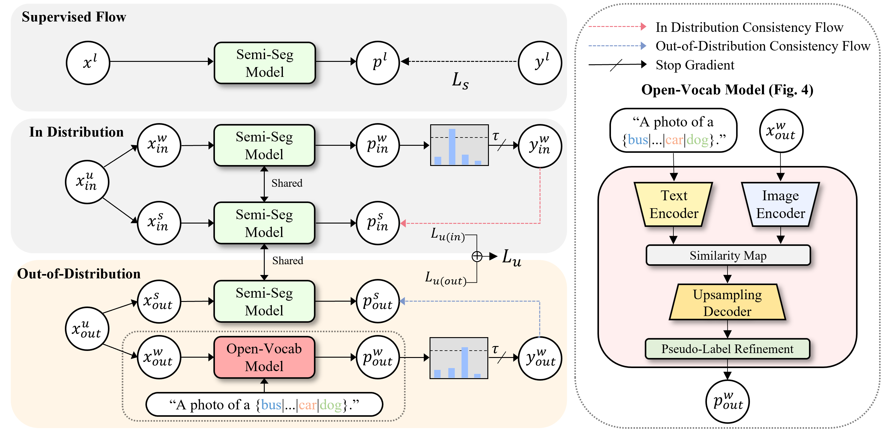

# SemiOVS

This is the official PyTorch implementation for the paper "Leveraging Out-of-Distribution Unlabeled Images: Semi-Supervised Semantic Segmentation with an Open-Vocabulary Model".


<p align="center">  </p>

**TL;DR**: While semi-supervised semantic segmentation could potentially benefit from large sets of unlabeled images available online, these web-scraped images often have different distributions (OOD) from the target dataset. This paper introduces SemiOVS, a new framework with open-vocabulary segmentation to effectively utilize these unlabeled OOD images.

<p align="center">  </p>
Naively using OOD images as unlabeled data can lead to inaccurate pseudo-labels. The above figure highlights these challenges, illustrating how a semantic segmentation model performs well on in-distribution samples but struggles with unseen objects in OOD scenarios.

<p align="center">  </p>
We evaluate SemiOVS with several baselines on Pascal VOC, showing its ability to enhance existing state-of-the-art methods, as shown above.
This demonstrates the potential of utilizing abundant OOD images for real-world semantic segmentation applications.


## Main Results

### Pascal VOC 2012


| Method                      |  92  | 183  | 366  | 732  | 1464 |
| :-------------------------: | :--: | :--: | :--: | :--: | :--: |
| CorrMatch  (CVPR'24)        | 76.4 | 78.5 | 79.4 | 80.6 | 81.8 |
| DDFP       (CVPR'24)        | 75.0 | 78.0 | 79.5 | 81.2 | 82.0 |
| AllSpark   (CVPR'24)        | 76.1 | 78.4 | 79.8 | 80.8 | 82.1 |
| UniMatch   (CVPR'23)        | 75.2 | 77.2 | 78.8 | 79.9 | 81.2 |
| SemiOVS (w/ UniMatch)       | **80.4(+5.2)** | **81.3(+4.1)** | **81.6(+2.8)** | **81.7(+1.8)** | **81.8(+0.6)** |
| PrevMatch  (Arxiv'24)       | 77.0  | 78.5  | 79.6  | 80.4  | 81.6  |
| SemiOVS (w/ PrevMatch)      | **80.5(+3.5)** | **81.5(+3.0)** | **81.4(+1.8)** | **81.8(+1.4)** | **81.9(+0.3)** |
| SemiVL     (ECCV'24)        | 84.0 | 85.6 | 86.0 | 86.7 | 87.3 |
| SemiOVS (w/ SemiVL)         | **87.0(+3.0)** | **87.3(+1.7)** | **87.5(+1.5)** | **87.9(+1.2)** | **88.0(+0.7)** |


## Getting Started

### Environment & Requirements
```bash
# For generating pseudo labels using open-vocab models & training SemiOVS
conda create -n semiovs python=3.9 -y
conda activate semiovs
pip install torch==1.13.1+cu116 torchvision==0.14.1+cu116 --extra-index-url https://download.pytorch.org/whl/cu116
cd generate_pseudo_label_via_ovs/
pip install -r requirements.txt
cd open_clip/
make install

## For training SemiOVS with SemiVL
conda create -n semiovs_semivl python=3.9 -y
conda activate semiovs_semivl
cd semiovs_semivl/
pip install -r requirements.txt
```

### Download Pretrained Weights
We use the pre-trained weights for (1) OVS Model, (2) UniMatch & PrevMatch, and (3) SemiVL.

#### For OVS model

We use the checkpoint provided by official [SED](https://github.com/xb534/SED) repository. Please download from this [URL](https://drive.google.com/file/d/1zAXE0QXy47n0cVn7j_2cSR85eqxdDGg8/view) and put them in `generate_pseudo_label_via_ovs/pretrained/`


#### For UniMatch & PrevMatch
Please download the weights file and put them under `semiovs/pretrained/` folder.

[ResNet-50](https://github.com/wooseok-shin/SemiOVS/releases/download/preliminary/resnet50.pth) | [ResNet-101](https://github.com/wooseok-shin/SemiOVS/releases/download/preliminary/resnet101.pth)


#### For SemiVL
Please download the weights file and put them under `semiovs_semivl/pretrained/` folder.

[ViT-B/16 (CLIP-B)](https://github.com/wooseok-shin/SemiOVS/releases/download/preliminary/clip2mmseg_ViT16_clip_backbone.pth)

We use the checkpoint provided by [SemiVL](https://github.com/google-research/semivl).


### Setup Datasets

Please follow [dataset preparation](https://github.com/wooseok-shin/SemiOVS/tree/main/data)


## Usage

### Generate pseudo-labels using OVS
We produce pseudo-label masks using the open-vocabulary segmentation model (SED), as described in the implementation details of the paper.

```bash
cd generate_pseudo_label_via_ovs
conda activate semiovs_gen
sh inference.sh configs/convnextL_768.yaml 1 output/
```


### Training SemiOVS with UniMatch & PrevMatch
we produced our results using 1 GPU for the Pascal VOC and Context datasets.

```bash
cd semiovs
conda activate semiovs
sh scripts/train_<dataset>.sh <num_gpu> <port> <splits>
# Pascal VOC
# sh scripts/train_pascal.sh 1 11 92

# Pascal Context
# sh scripts/train_pc60.sh 1 11 1_32
```

### Training SemiOVS with SemiVL
we produced our results using 2 GPUs.
You can change the n_gpus argument in experiments.py for faster training.

```bash
cd semiovs_semivl
conda activate semiovs_semivl
python experiments.py --exp <EXP_ID> --run <RUN_ID>
# python experiments.py --exp 40 --run 0 (=Pascal VOC - 92 label setting)
# python experiments.py --exp 40 --run 4 (=Pascal VOC - 1464 label setting)
```


## Acknowledgements
SemiOVS is based on [UniMatch](https://github.com/LiheYoung/UniMatch), [PrevMatch](https://github.com/wooseok-shin/PrevMatch), [SemiVL](https://github.com/google-research/semivl), and [SED](https://github.com/xb534/SED).
We are grateful to their authors for open-sourcing their code.